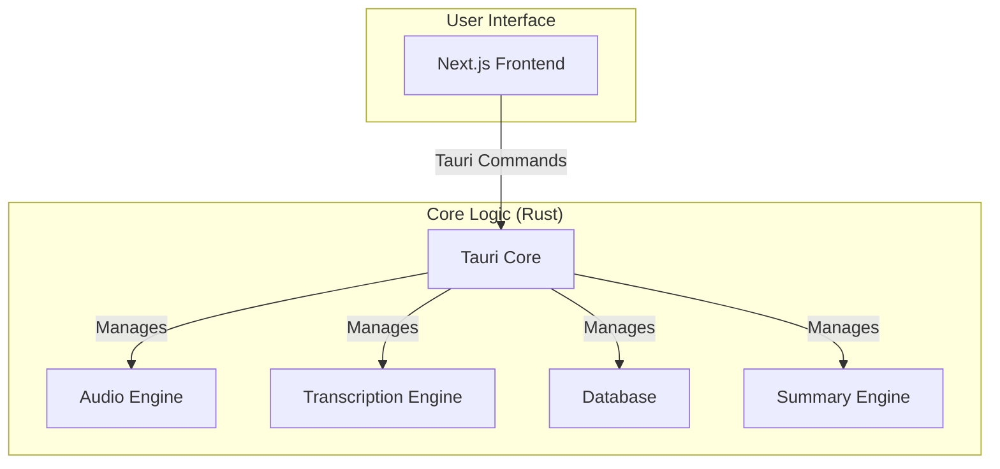

# System Architecture

Meetily is a self-contained desktop application built with [Tauri](https://tauri.app/). It combines a Rust-based backend with a Next.js frontend into a single, efficient, and cross-platform application.

## High-Level Architecture Diagram

## Component Details

### Frontend (Next.js)

*   Provides the user interface for managing meetings, displaying transcriptions, and configuring the application.
*   Communicates with the Rust core through Tauri's command system.

### Backend (Rust Core)

*   **Tauri Core:** The heart of the application, responsible for managing the window, handling events, and exposing the Rust core to the frontend.
*   **Audio Engine:** Captures audio from the microphone and system, processes it, and prepares it for transcription.
*   **Transcription Engine:** Uses local speech-to-text models (Whisper or Parakeet) through a required GPU backend. Whisper supports Metal, CUDA, Vulkan, and HIP; Parakeet activates through CUDA ONNX Runtime with CPU fallback disabled.
*   **Database:** A local SQLite database that stores meeting metadata, transcripts, and summaries.
*   **Summary Engine:** Generates meeting summaries using various Large Language Models (LLMs), including local models via Ollama.

## Engineering Notes

*   [2026-07-08 Tauri / Next.js hydration and Breeze ASR 25 record](engineering-notes/2026-07-08-tauri-next-hydration-breeze-asr.md): documents a dev startup triage where SSR rendered but hydration was blocked by chunk loading/CSP risk, and records the Breeze ASR 25 CT2 vs whisper-rs GGML/GGUF compatibility boundary.
*   [2026-07-14 Audio owner thread and GPU-only ASR audit](audit-events/2026-07-14-audio-owner-gpu-asr-hardening/audit-event.md): connects the native crash follow-up, CPAL owner-thread migration, model-language routing, GPU activation contract, live CUDA evidence, publication trail, and remaining soak-test gate.
